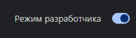
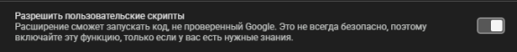
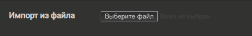
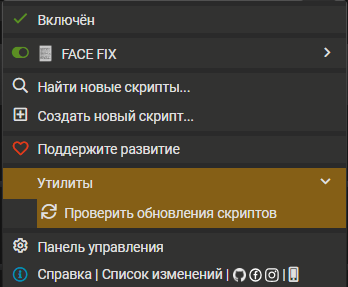

# FACE FIX

Userscript для улучшения интерфейса и ускорения работы с платформой **К!Успеху / FACE**.

Скрипт устанавливается через [Tampermonkey](https://chromewebstore.google.com/detail/tampermonkey/dhdgffkkebhmkfjojejmpbldmpobfkfo) и автоматически обновляется из этого репозитория.

**Текущая версия: 4.1.11**

---

## Что делает FACE FIX

Скрипт добавляет и изменяет различные элементы интерфейса FACE, чтобы сделать работу с фотозаданиями удобнее.

В частности:

* добавляет быстрые кнопки для открытия заданий и транзакций;
* переносит изображения-примеры в более удобное место;
* для MS-заданий собирает изображения-примеры в отдельный блок;
* делает некоторые значения интерфейса кликабельными для копирования;
* разделяет информацию о задании на две колонки;
* добавляет подсказки по горячим клавишам;
* добавляет подсказки с причинами отклонения;
* уменьшает занимающие место уведомления;
* добавляет клавиатурную навигацию;
* считает выполненные фотозадания по типам;
* показывает приблизительное суммарное время нагрузки по заданиям;


---

# Установка

## 1. Установить Tampermonkey

Установите расширение **Tampermonkey** для браузера:

[Установить Tampermonkey из Chrome Web Store](https://chromewebstore.google.com/detail/tampermonkey/dhdgffkkebhmkfjojejmpbldmpobfkfo)

---

## 2. Включить режим разработчика

Откройте страницу расширений:

```text
chrome://extensions/
```

В правом верхнем углу включите **«Режим разработчика»**.



> В некоторых браузерах название или расположение этого пункта может немного отличаться.

---

## 3. Разрешить пользовательские скрипты

Для Tampermonkey также рекомендуется включить разрешение **«Разрешить пользовательские скрипты»**.



---

## 4. Скачать FACE FIX

Скачайте файл со страницы релиза:

[**Скачать FACE FIX**](https://github.com/freonwarded/face-fix/releases/download/Plug/face-fix.user.js)

Либо откройте файл в репозитории и нажмите **Raw → Сохранить страницу как...**

> Важно: нужен именно файл `.user.js`, а не HTML-страница GitHub.

---

## 5. Импортировать скрипт в Tampermonkey

Откройте панель Tampermonkey и перейдите в:

**Настройки → Утилиты → Импорт из файла**

Либо откройте страницу утилит Tampermonkey напрямую:

```text
chrome-extension://dhdgffkkebhmkfjojejmpbldmpobfkfo/options.html#nav=utils
```

Нажмите **«Импорт из файла»** и выберите скачанный `face-fix.user.js`.



После импорта подтвердите установку скрипта.

---

## 6. Проверить обновления

После установки **обязательно проверьте обновления**.

В Tampermonkey откройте настройки обновлений и выполните проверку.



FACE FIX настроен на автоматическое получение новых версий из GitHub.

---

## 7. Перезагрузить FACE

После установки и обновления перезагрузите страницу FACE.

Если всё установлено правильно, интерфейс изменится и появятся дополнительные элементы FACE FIX.

Версию установленного скрипта можно увидеть справа сверху


Текущая версия также указана непосредственно в коде скрипта.

---

# Обновление

Вручную переустанавливать скрипт при каждом обновлении **не требуется**.

FACE FIX содержит ссылки на GitHub для автоматической проверки и загрузки новых версий:

```text
https://raw.githubusercontent.com/freonwarded/face-fix/main/face-fix.user.js
```

После выхода новой версии Tampermonkey сможет получить обновление автоматически.

При появлении новой версии FACE FIX также покажет окно с информацией об изменениях.

---

# Важно

Устанавливая FACE FIX, вы понимаете и принимаете возможные риски, связанные с использованием пользовательского скрипта.

Скрипт изменяет интерфейс FACE и **может работать некорректно**, особенно после изменений самой платформы.

Возможны, например:

* некорректное отображение элементов;
* визуальные ошибки;
* конфликт с изменениями интерфейса FACE;
* неожиданное поведение отдельных кнопок или горячих клавиш;
* или вы случайно можете нажать на клавиатуре лишний раз пробел и отправить заказчику интимные фото.

**Автор не несёт ответственности за последствия использования скрипта.**

Особенно внимательно относитесь к горячим клавишам и кнопкам подтверждения.

> Бывает всякое.

Обычно я все тестировал перед выпуском, а элементы, связанные с оценкой заданий, проектировались с учетом необходимости избежать случайных действий.

Но полностью исключить человеческий фактор и ошибки невозможно. А учитывая, что я уже не работаю и не слежу за актуальностью, проблемы могут быть особо острыми.

---

# Обратная связь

Если нашли баг, столкнулись с некорректным отображением, что-то обновилось на платформе или у вас есть предложение по улучшению FACE FIX - сообщите об этом. Возможно у меня будет желание и время.

**Telegram:** [@tosha_blyat](https://t.me/tosha_blyat)

При сообщении об ошибке желательно указать:

1. что именно произошло;
2. на какой странице это произошло;
3. что должно было произойти;
4. версию FACE FIX;
5. скриншот проблемы, если он помогает её понять.

---


**Приятного аппетита.**
